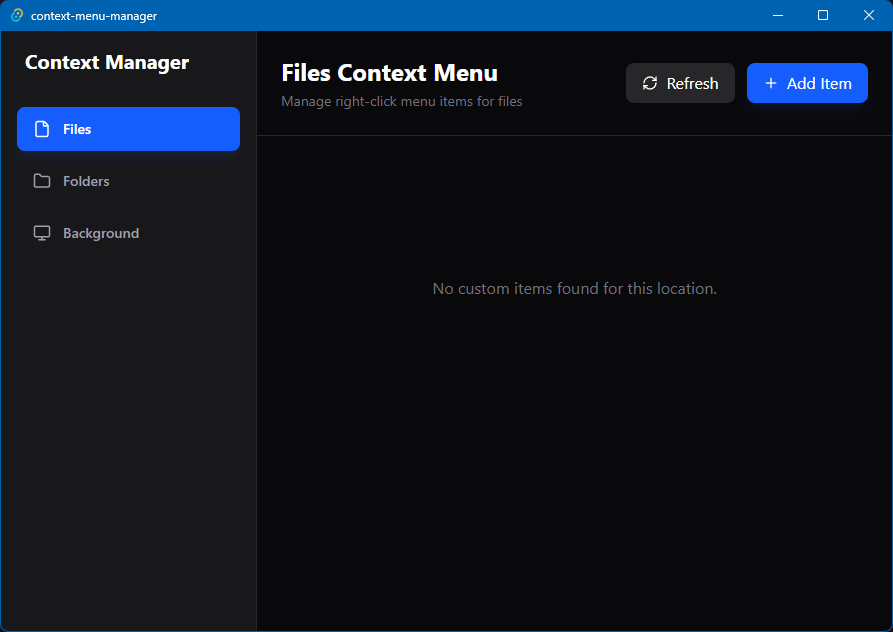
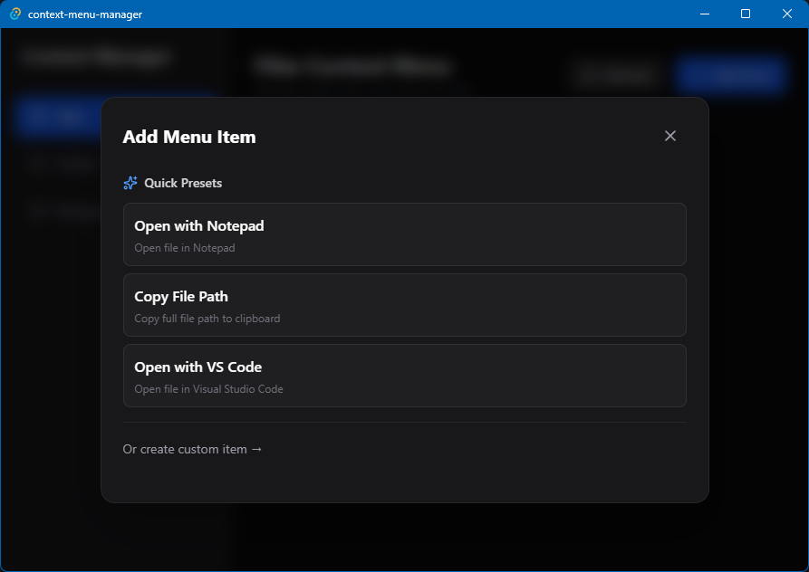
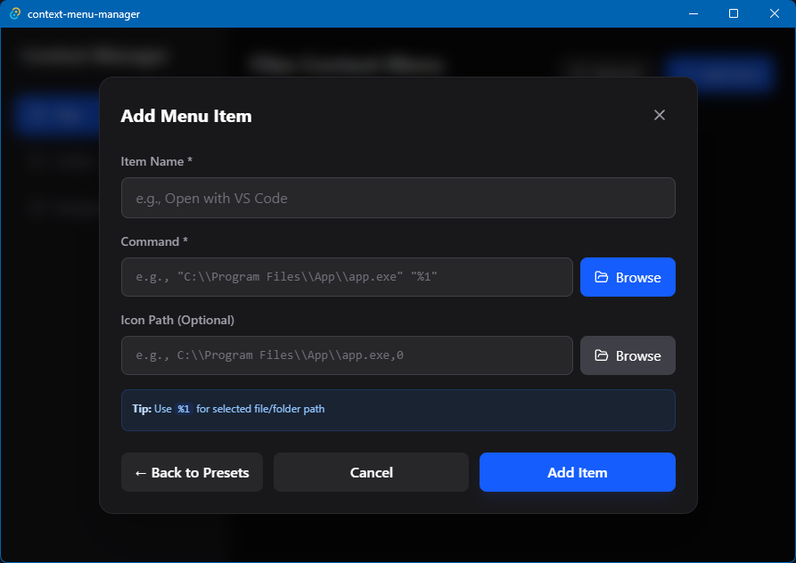

# Windows Context Menu Manager

<div align="center">


[](https://opensource.org/licenses/MIT)
[](https://tauri.app)
[](https://www.rust-lang.org)
[](https://reactjs.org)

**A modern, user-friendly desktop application for customizing Windows right-click context menus without manually editing the registry.**

[Features](#-features) • [Installation](#-installation) • [Usage](#-usage) • [Development](#-development) • [Contributing](#-contributing)


</div>

---

## 🎯 Features

- ✅ **Visual Registry Editor** - Manage context menu items through an intuitive UI
- ✅ **Preset Templates** - One-click setup for common applications (Notepad, CMD, PowerShell, VS Code)
- ✅ **File Browser** - Select executables visually instead of typing paths
- ✅ **Safe Operations** - User-scope registry modifications (no admin required)
- ✅ **Real-time Preview** - See existing context menu items instantly
- ✅ **Modern UI** - Dark theme with smooth animations and glassmorphism
- ✅ **Three Contexts** - Manage menus for Files, Folders, and Desktop Background
- ✅ **Auto Icon Detection** - Automatically extracts icons from executables

## 📸 Screenshots

### Main Interface


### Preset Templates


### Custom Item Editor


## 🚀 Installation

### Option 1: Download Pre-built Binary (Recommended)

1. Go to [Releases](https://github.com/GitHackerz/context-menu-manager/releases)
2. Download the latest `context-menu-manager.exe`
3. Run the executable - no installation needed!

### Option 2: Build from Source

#### Prerequisites

- **Node.js** 18+ ([Download](https://nodejs.org))
- **Rust** 1.91+ ([Download](https://rustup.rs))
- **Git** ([Download](https://git-scm.com))

#### Build Steps

```bash
# Clone the repository
git clone https://github.com/GitHackerz/context-menu-manager.git
cd context-menu-manager

# Install dependencies
npm install

# Run in development mode
npm run tauri dev

# Build production executable
npm run tauri build
```

The production `.exe` will be in `src-tauri/target/release/`

> **Note**: If you encounter linker errors on Windows, see [Build Troubleshooting](docs/BUILD_TROUBLESHOOTING.md)

## 📖 Usage

### Quick Start

1. **Launch the app** - Double-click `context-menu-manager.exe`
2. **Select a context** - Choose Files, Folders, or Background from the sidebar
3. **Add an item**:
   - Click the blue **"Add Item"** button
   - Choose a preset template OR create a custom item
   - For custom items, use the **Browse** button to select an executable
4. **Test it** - Right-click a file/folder in Windows Explorer to see your new menu item!

### Using Presets

The app includes ready-to-use templates:

**For Files:**
- Open with Notepad
- Copy File Path
- Open with VS Code

**For Folders:**
- Open CMD Here
- Open PowerShell Here
- Copy Folder Path

**For Background:**
- Open CMD Here
- Open PowerShell Here

### Creating Custom Items

1. Click **"Add Item"** → **"Or create custom item"**
2. Fill in the form:
   - **Name**: Display text (e.g., "Open with Sublime")
   - **Command**: Click **Browse** to select the executable
   - **Icon** (optional): Click **Browse** to select an icon file
3. Click **"Add Item"**

**Tips:**
- Use `%1` in commands to reference the selected file/folder
- For background items, use `%V` instead of `%1`
- Icon paths should end with `,0` (e.g., `C:\app.exe,0`)

### Examples

#### Open with Sublime Text
```
Name: Open with Sublime
Command: "C:\Program Files\Sublime Text\sublime_text.exe" "%1"
Icon: C:\Program Files\Sublime Text\sublime_text.exe,0
```

#### Copy File Path
```
Name: Copy Path
Command: cmd /c echo "%1" | clip
Icon: (leave empty)
```

#### Open Terminal Here (for folders)
```
Name: Terminal Here
Command: wt.exe -d "%1"
Icon: C:\Program Files\WindowsApps\Microsoft.WindowsTerminal_*\wt.exe,0
```

## 🛠️ Development

### Project Structure

```
context-menu-manager/
├── src/                      # React frontend
│   ├── components/           # UI components
│   │   ├── Sidebar.tsx
│   │   ├── MenuItemList.tsx
│   │   └── EditorModal.tsx
│   ├── lib/
│   │   └── utils.ts
│   ├── App.tsx              # Main app logic
│   └── index.css            # Tailwind styles
├── src-tauri/               # Rust backend
│   ├── src/
│   │   ├── registry_manager.rs  # Registry operations
│   │   ├── lib.rs               # Tauri setup
│   │   └── main.rs
│   └── Cargo.toml
├── docs/                    # Documentation
├── .github/                 # GitHub workflows & templates
└── README.md
```

### Tech Stack

- **Frontend**: React 18 + TypeScript + Tailwind CSS
- **Backend**: Rust + Tauri 2.0
- **Registry Access**: `winreg` crate
- **UI Icons**: Lucide React
- **Build Tool**: Vite

### Development Commands

```bash
# Install dependencies
npm install

# Run development server (hot reload)
npm run tauri dev

# Build production
npm run tauri build

# Lint code
npm run lint

# Format code
npm run format
```

### Registry Paths

The app modifies these registry keys (user-scope only):

- **Files**: `HKCU\Software\Classes\*\shell`
- **Folders**: `HKCU\Software\Classes\Directory\shell`
- **Background**: `HKCU\Software\Classes\Directory\Background\shell`

## 🤝 Contributing

We welcome contributions! Please see [CONTRIBUTING.md](CONTRIBUTING.md) for details.

### Quick Contribution Guide

1. Fork the repository
2. Create a feature branch (`git checkout -b feature/amazing-feature`)
3. Commit your changes (`git commit -m 'Add amazing feature'`)
4. Push to the branch (`git push origin feature/amazing-feature`)
5. Open a Pull Request

### Development Setup

See [CONTRIBUTING.md](CONTRIBUTING.md) for detailed setup instructions.

## 📝 License

This project is licensed under the MIT License - see the [LICENSE](LICENSE) file for details.

## 🙏 Acknowledgments

- [Tauri](https://tauri.app) - For the amazing desktop app framework
- [Lucide](https://lucide.dev) - For the beautiful icons
- [Tailwind CSS](https://tailwindcss.com) - For the utility-first CSS framework

## 🐛 Bug Reports & Feature Requests

Found a bug or have a feature idea? Please [open an issue](https://github.com/GitHackerz/context-menu-manager/issues/new/choose)!

## 📊 Project Status

- ✅ Core functionality complete
- ✅ Preset templates implemented
- ✅ File browser integration
- 🚧 Backup/restore functionality (planned)
- 🚧 Import/export configurations (planned)
- 🚧 Multi-language support (planned)

## 🔒 Security

This app only modifies user-scope registry keys (`HKEY_CURRENT_USER`), making it safe to use without administrator privileges. All changes are isolated to your user account and can be easily reverted.

## 💬 Support

- **Documentation**: [docs/](docs/)
- **Issues**: [GitHub Issues](https://github.com/GitHackerz/context-menu-manager/issues)
- **Discussions**: [GitHub Discussions](https://github.com/GitHackerz/context-menu-manager/discussions)

---

<div align="center">

**Made with ❤️ by the community**

[⬆ Back to Top](#windows-context-menu-manager)

</div>
